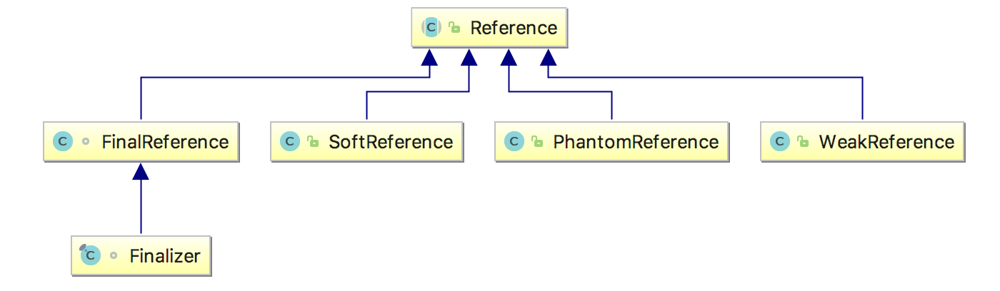
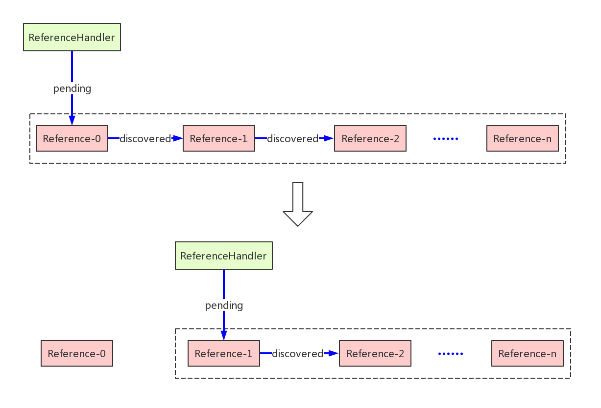
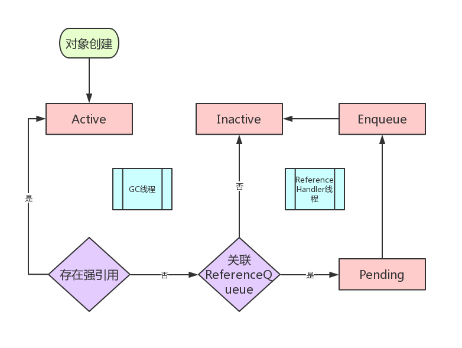
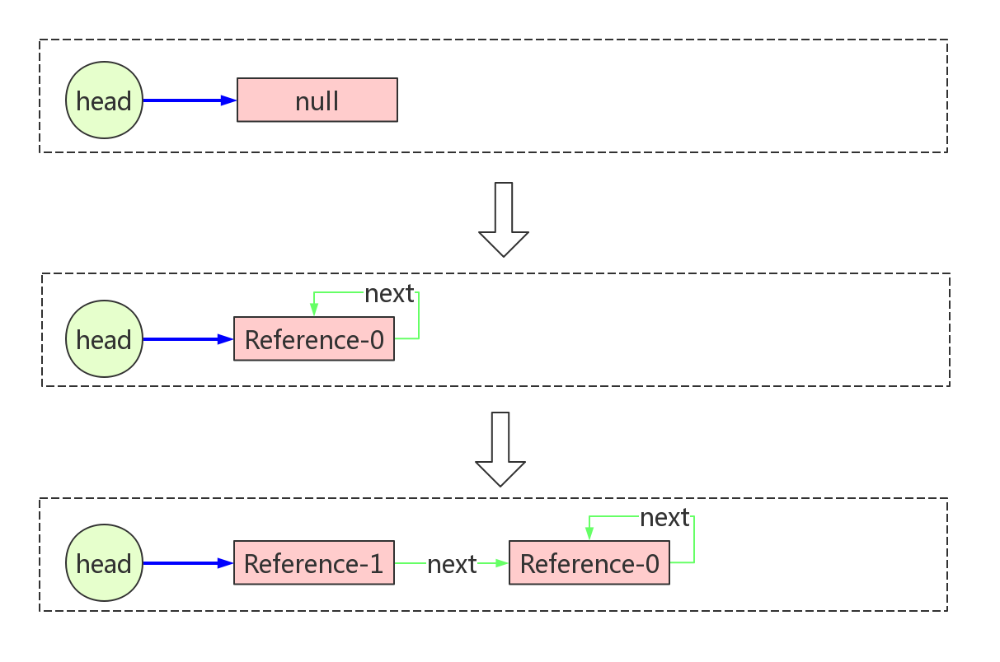
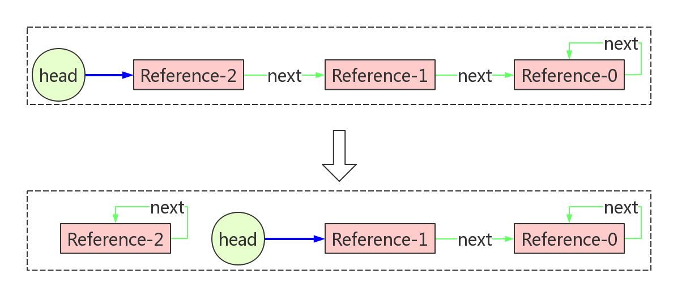
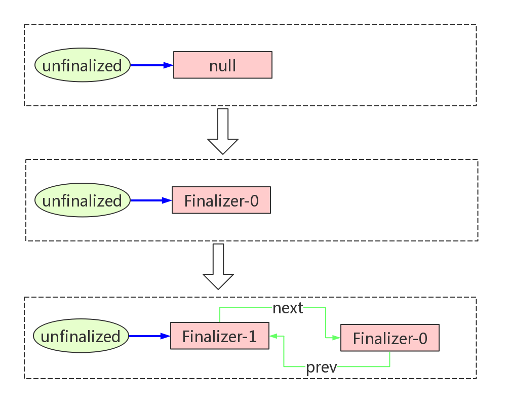
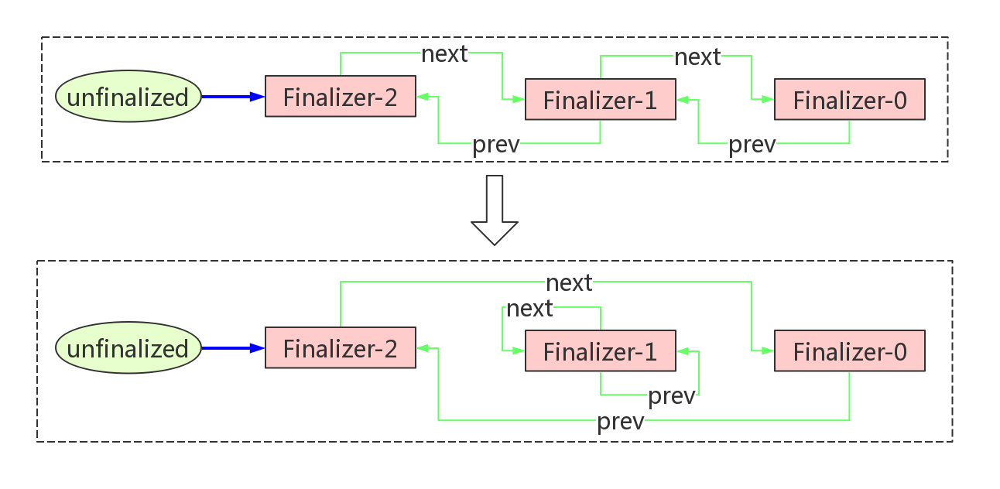

# Reference深度剖析

# 1、引用级别

在JVM中，垃圾回收器一直在背后默默地承担着内存回收的工作，我们不需要像使用C语音开发那样小心翼翼地管理内存。但是凡事皆有两面性，这种机制的好处是极大地释放了程序员无处安放的焦虑，坏处是难以对回收过程进行更灵活地干预。

为了增加对垃圾回收的力度把控，Java引入了引用级别的概念。


在JDK 1.2以前的版本中，只有在对象没有任何其他对象引用它时，垃圾回收器才会对它进行收集。对象只有被引用和没有被引用两种状态。这种方式无法描述一些“食之无味，弃之可惜”的对象。而很多时候，我们希望存在这样一些对象：当内存空间足够时，不进行回收；当内存空间变得紧张时，允许JVM回收这些对象。大部分缓存都符合这样的场景。

从JDK 1.2版本开始，Java对引用的概念进行了扩充，对象的引用分成了4种级别，从而使程序开发者能更加灵活地控制对象的生命周期，更好的控制创建的对象何时被释放和回收。

这4种级别由高到低依次为：强引用、软引用、弱引用和虚引用。

## 1.1 强引用(StrongReference)

我们使用的大部分的引用都是强引用，这是使用最普遍的引用。如果一个对象具有强引用，那就类似于必不可少的生活用品，垃圾回收器绝不会回收它。当内存空间不足，Java虚拟机宁愿抛出OutOfMemoryError错误，使程序异常终止，也不会靠随意回收具有强引用的对象来解决内存不足问题。

如果强引用对象不使用时，需要弱化从而使GC能够回收，如：
`strongReference = null;`
显式地设置strongReference对象为null，或让其超出对象的生命周期范围，则gc认为该对象不存在引用，这时就可以回收这个对象。具体什么时候收集这要取决于GC算法。

```java
public void test() {
	Object strongReference = new Object();
	// 省略其他操作
}
```

在一个方法的内部有一个强引用，这个引用保存在Java栈中，而真正的引用内容(Object)保存在Java堆中。 当这个方法运行完成后，就会退出方法栈，则引用对象的引用数为0，这个对象会被回收。但是如果这个strongReference是全局变量时，就需要在不用这个对象时赋值为null，因为强引用不会被垃圾回收。


ArrayList的Clear方法：


```java
public void clear() {
    modCount++;

    // clear to let GC do its work
    for (int i = 0; i < size; i++)
        elementData[i] = null;

    size = 0;
}
```
在ArrayList类中定义了一个elementData数组，在调用clear方法清空数组时，每个数组元素被赋值为null。 但是，这里为什么不直接将数组设置为null：

`elementData=null;`

一行代码搞定，岂不更加简单粗暴？
如果将整个数组指向null，该数组的内存空间会被回收掉，而将数组的元素逐个指向null只会把数组中存放的强引用释放，整个数组对象还是存在的，这样以来，如果再有add()等操作就不用再次分配内存了。

 ## 1.2 软引用（SoftReference）

如果一个对象只具有软引用，那就类似于可有可无的生活用品。如果内存空间足够，垃圾回收器就不会回收它，如果内存空间不足了，就会回收这些对象的内存。只要垃圾回收器没有回收它，该对象就可以被程序使用。软引用可用来实现内存敏感的高速缓存。
软引用可以和一个引用队列（ReferenceQueue）联合使用，如果软引用所引用的对象被垃圾回收，JAVA虚拟机就会把这个软引用加入到与之关联的引用队列中。

```java
    ReferenceQueue<String> referenceQueue = new ReferenceQueue<>();
    String str = new String("abc");
    SoftReference<String> softReference = new SoftReference<>(str, referenceQueue);

    str = null;
    // Notify GC
    System.gc();

    System.out.println(softReference.get()); // abc

    Reference<? extends String> reference = referenceQueue.poll();
    System.out.println(reference); //null
```

**注意：** 软引用对象是在jvm内存不够的时候才会被回收，我们调用System.gc()方法只是起通知作用，JVM什么时候扫描回收对象是JVM自己的状态决定的。就算扫描到软引用对象也不一定会回收它，只有内存不够的时候才会回收。
当内存不足时，JVM首先将软引用中的对象引用置为null，然后通知垃圾回收器进行回收。也就是说，垃圾收集线程会在虚拟机抛出OutOfMemoryError之前回收软引用对象，而且虚拟机会尽可能优先回收长时间闲置不用的软引用对象。对那些刚构建的或刚使用过的“较新的”软对象会被虚拟机尽可能保留，这就是引入引用队列ReferenceQueue的原因。

## 1.3 弱引用（WeakReference）
弱引用与软引用的区别在于：只具有弱引用的对象拥有更短暂的生命周期。在垃圾回收器线程扫描它 所管辖的内存区域的过程中，一旦发现了只具有弱引用的对象，不管当前内存空间足够与否，都会回收它的内存。不过，由于垃圾回收器是一个优先级很低的线程， 因此不一定会很快发现那些只具有弱引用的对象。 
弱引用可以和一个引用队列（ReferenceQueue）联合使用，如果弱引用所引用的对象被垃圾回收，Java虚拟机就会把这个弱引用加入到与之关联的引用队列中。

```java
	String str = new String("abc");
	WeakReference<String> weakReference = new WeakReference<>(str);
	System.out.println(weakReference.get() == null); //false
		
	str = null;
	System.gc(); //触发垃圾回收
		
	System.out.println(weakReference.get() == null); //true
```

下面的代码会让一个弱引用再次变为一个强引用：

```java
    String str = new String("abc");
    WeakReference<String> weakReference = new WeakReference<>(str);
    // 弱引用转强引用
    String strongReference = weakReference.get();
```

## 1.4 虚引用（PhantomReference）
"虚引用"顾名思义，就是形同虚设，与其他几种引用都不同，虚引用并不会决定对象的生命周期。如果一个对象仅持有虚引用，那么它就和没有任何引用一样，在任何时候都可能被垃圾回收。

```java
 	String str = new String("abc");
    ReferenceQueue queue = new ReferenceQueue();
    // 创建虚引用，要求必须与一个引用队列关联
    PhantomReference pr = new PhantomReference(str, queue);
```

虚引用主要用来跟踪对象被垃圾回收的活动。虚引用与软引用和弱引用的一个区别在于：虚引用必须和引用队列（ReferenceQueue）联合使用。当垃 圾回收器准备回收一个对象时，如果发现它还有虚引用，就会在回收对象的内存之前，把这个虚引用加入到与之关联的引用队列中。程序可以通过判断引用队列中是 否已经加入了虚引用，来了解被引用的对象是否将要被垃圾回收。程序如果发现某个虚引用已经被加入到引用队列，那么就可以在所引用的对象的内存被回收之前采取必要的行动。

# 2、java.lang.ref包

java.lang.ref包下都是与reference相关的类，包括：



- **Reference**：引用对象的抽象基类，定义了所有引用对象的通用操作
- **ReferenceQueue**： 引用队列，垃圾回收器在检测到对象可以回收时，会将该对象的Reference放到队列（如果有）
- **SoftReference**：Reference子类，代表软引用
- **WeakReference**：Reference子类，代表弱引用
- **PhantomReference**：Reference子类，代表虚引用
- **FinalReference**：Reference子类，访问权限是package，外部无法访问，由JVM来实例化，JVM会对那些实现了Object中finalize()方法的类实例化一个对应的FinalReference
- **Finalizerd**：FinalReference子类，访问权限是package，且为final类，外部无法访问。JVM实际操作的是Finalizer。当一个类满足实例化FinalReference的条件时，JVM会调用Finalizer.register()进行注册


# 3、Reference

## 3.1 内部变量

先来看一下Reference类中的变量

```java
    private T referent;  

    volatile ReferenceQueue<? super T> queue;
    Reference next;

	private static Reference<Object> pending = null;
	transient private Reference<T> discovered;

    static private class Lock { }
    private static Lock lock = new Lock(); 
```

- **referent**

表示其引用的对象，即在构造的时候需要被包装在其中的对象。

- **queue** 

是对象即将被回收时所要通知的队列。当对象即将被回收时，整个reference对象，而不仅仅是被回收的对象，会被放到queue 里面，然后外部程序通过监控这个 queue 即可拿到相应的数据了。ReferenceQueue并不是一个链表数据结构，它只持有这个链表的表头对象header，这个链表是由Refence对象里面的next变量构建起来，next也就是链表当前节点的下一个节点，所以Reference对象本身就是一个链表的节点，这个链表由ReferenceHander线程从pending队列中取出的数据构建而来

- **next** 

与queue 搭配使用，仅在Reference放到queue中时才有意义，一系列的Reference正是依靠next组成了一个单链表

- **pending** 

pending与后面的discovered一起构成了一个pending单向链表。注意这个变量是一个**静态对象**，所以是全局唯一的。pending为链表的头节点，discovered为链表当前Reference节点指向下一个节点的引用，这个队列是由JVM构建的，当对象除了被reference引用之外没有其它强引用了，JVM就会将指向需要回收的对象的Reference都放入到这个队列里面（注意是指向要回收的对象的Reference，要回收的对象就是Reference的成员变量refernt持有的对象，是refernt持有的对象要被回收，而不是Reference对象本身），这个队列会由ReferenceHander线程来处理。

- **discovered** 

表示ReferenceHander要处理的pending对象的下一个对象。ReferenceHander只需要不停地拿到pending，然后再通过discovered 不断地拿到下一个对象赋值给pending即可，直到取到了最有一个。

- **lock**

lock是pending队列的全局锁，只在ReferenceHander线程的run方法里面用到。但是，除了当前线程，JVM垃圾回收器线程也会操作pending队列，所以需要通过这个锁来防止并发问题。

## 3.2 ReferenceHander

ReferenceHanderReference的一个内部类，继承自Thread：

```java
    private static class ReferenceHandler extends Thread {

        private static void ensureClassInitialized(Class<?> clazz) {
            try {
                Class.forName(clazz.getName(), true, clazz.getClassLoader());
            } catch (ClassNotFoundException e) {
                throw (Error) new NoClassDefFoundError(e.getMessage()).initCause(e);
            }
        }

        static {
           // 确保依赖的其他类已被加载
            ensureClassInitialized(InterruptedException.class);
            ensureClassInitialized(Cleaner.class);
        }

        ReferenceHandler(ThreadGroup g, String name) {
            super(g, name);
        }

        public void run() {
            while (true) {
                //启动后无限循环，调用tryHandlePending方法
                tryHandlePending(true);
            }
        }
    }

    static boolean tryHandlePending(boolean waitForNotify) {
        Reference<Object> r;
        Cleaner c;
        try {
            //此处需要加全局锁，因为除了当前线程，gc线程也会操作pending队列
            synchronized (lock) {
                //如果pending队列不为空，则将第一个Reference对象取出
                if (pending != null) {
                    r = pending;
                    c = r instanceof Cleaner ? (Cleaner) r : null;
                    //将头节点指向discovered，即队列中的下一个节点，这样就把第一个头结点出队了
                    pending = r.discovered;
                     //将当前节点的discovered设置为null；当前节点已出队，不再需要链表序列
                    r.discovered = null;
                } else {
                    //如果pending队列为空且需要等待，则进入阻塞状态
                    if (waitForNotify) {
                        lock.wait();
                    }
                   
                    return waitForNotify;
                }
            }
        } catch (OutOfMemoryError x) {
            Thread.yield();
            return true;
        } catch (InterruptedException x) {
            return true;
        }

        // 如果从pending队列出队的是一个Cleaner对象，那么直接执行其clean()方法
        if (c != null) {
            c.clean();
            //注意这里，这里已经不往下执行了，所以Cleaner对象是不会进入到队列里面的，给它设置ReferenceQueue的作用是为了让它能进入Pending队列后被ReferenceHander线程处理
            return true;
        }

        //如果绑定了ReferenceQueue队列，则将对象插入其中
        ReferenceQueue<? super Object> q = r.queue;
        if (q != ReferenceQueue.NULL) q.enqueue(r);
        return true;
    }
```

可见，ReferenceHander的任务就是将pending队列中要被回收的Reference对象移除出来，如果Reference对象在初始化的时候传入了ReferenceQueue队列，那么就把从pending队列里面移除的Reference放到它自己的ReferenceQueue队列里，如果没有ReferenceQueue队列，那么其关联的对象就不会进入到Pending队列中，会直接被回收掉。

如果把pending与discovered看做指针，ReferenceHander操作pending队列的流程可以简化为下图：



那么问题来了：

1、Reference 源码中并没有发现给 discovered和 pending 赋值的地方，是谁负责它们的初始化呢？

2、ReferenceHandler是什么时候由谁启动的？

问题1，pending队列由JVM的垃圾回收器维护，负责初始化discovered和 pending，并不断将新的Reference追加到队列当中。

问题2，去源码中寻找答案，Reference类中有一段静态代码：

```java
    static {
        ThreadGroup tg = Thread.currentThread().getThreadGroup();
        for (ThreadGroup tgn = tg;
             tgn != null;
             tg = tgn, tgn = tg.getParent());
        Thread handler = new ReferenceHandler(tg, "Reference Handler");
        //拥有最高优先级
        handler.setPriority(Thread.MAX_PRIORITY); 
        //设为守护线程
        handler.setDaemon(true);
        //启动线程
        handler.start();

        // provide access in SharedSecrets
        SharedSecrets.setJavaLangRefAccess(new JavaLangRefAccess() {
            @Override
            public boolean tryHandlePendingReference() {
                return tryHandlePending(false);
            }
        });
    }
```

ReferenceHandler是一个拥有最高优先级的守护线程，在Reference类加载执行cinit的时候被初始化并启动。

## 3.3 Reference状态及其转换

Reference源码开头有一段很长的注释，说明了Reference对象的四种状态：

- **Active**

活动状态,对象存在强引用状态,还没有被回收

- **Pending**

垃圾回收器将没有强引用的Reference对象放入到pending队列中，等待ReferenceHander线程处理（前提是这个Reference对象创建的时候传入了ReferenceQueue，否则的话对象会直接进入Inactive状态）

- **Enqueued**

:ReferenceHander线程将pending队列中的对象取出来放到ReferenceQueue队列里

- **Inactive**

处于此状态的Reference对象可以被回收,并且其内部封装的对象也可以被回收掉了，有两个路径可以进入此状态：

路径一：在创建时没有传入ReferenceQueue的Reference对象，被Reference封装的对象在没有强引用时，指向它的Reference对象会直接进入此状态；

路径二：此Reference对象经过前面三个状态后，已经由外部从ReferenceQueue中获取到,并且已经处理掉了。

状态的转换示意图如下：



从代码层面来说，Reference对象的状态只需要通过成员变量next和queue来判断：

- **Active**：next=null
- **Pending**：next = this, queue = ReferenceQueue
- **Enqueued**：queue =ReferenceQueue.ENQUEUED
- **Inactive**：next = this, queue = ReferenceQueue.NULL;

可以结合后面的ReferenceQueue源码加深理解。

# 4、 ReferenceQueue

## 4.1 内部变量

```java
    private static class Null<S> extends ReferenceQueue<S> {
        boolean enqueue(Reference<? extends S> r) {
            return false;
        }
    }   
	static ReferenceQueue<Object> NULL = new Null<>();
    static ReferenceQueue<Object> ENQUEUED = new Null<>();

    static private class Lock { };
    private Lock lock = new Lock();

	//队列头
    private volatile Reference<? extends T> head = null;
	//队列长度
    private long queueLength = 0;
```

ReferenceQueue定义了一个内部类`Null<S>`，重写了enqueue入队方法，永远返回false，所以它不会存储任何数据，是一个用来做状态识别的空队列。
成员变量`NULL`和`ENQUEUED`是内部类的两个实例，用以标识Reference的状态。当Reference对象创建时没有指定queue或Reference对象已经处于inactive状态时，其持有的queue会指向`NULL`；当Reference被ReferenceHander线程从pending队列移到queue里面时，其持有的queue会指向`ENQUEUED`。

与Reference类似，ReferenceQueue内部也定义了一个`Lock`类，内部没有任何代码填充，就是一个标志类，用来充当锁的载体。但是，Reference中的Reference中的lock变量是静态的，也就是被所有实例共享的；而ReferenceQueue中的lock变量是非静态的，也就是每个ReferenceQueue实例独占一份，这是为什么呢？
原因在于，Reference中的lock用于锁定pending队列，pending队列本身就是静态变量，全局唯一，`lock`变量当然也得是静态的；而ReferenceQueue是与某个具体的Reference绑定，入队、出队等操作对于每个ReferenceQueue实例来说都是相互独立的，只需要锁定实例相关的队列即可，所以`lock`是实例变量，而非静态变量

`head`变量持有队列的队头，`head`与Reference中的`next`变量构成了一个单链表。Reference对象是从队头做出队入队操作，所以它是一个后进先出的队列，其实在数据结构上更像更像一个栈。

## 4.2 入队操作

```java
    boolean enqueue(Reference<? extends T> r) { 
        //首先要锁定队列
        synchronized (lock) { 
            ReferenceQueue<?> queue = r.queue;
            //如果Reference没有绑定队列，或者已经入队，直接返回
            if ((queue == NULL) || (queue == ENQUEUED)) {
                return false;
            }
            assert queue == this;
            //将Reference设为已入队状态
            r.queue = ENQUEUED;
            //如果队列为空，Reference的next指向自己（自己将会成为队头）；否则，指向队头
            r.next = (head == null) ? r : head;
            //将自己设为队头
            head = r;
            //增加队列长度
            queueLength++;
            if (r instanceof FinalReference) {
                sun.misc.VM.addFinalRefCount(1);
            }
            //唤醒出队操作的等待线程
            lock.notifyAll();
            return true;
        }
    }
```

入队的操作很简单，就是不断地将新对象插入到队头，流程示意图如下：



## 4.3 出队操作

有两种出队操作：

- **poll**：非阻塞式，队列中没有对象直接返回
- **remove**：阻塞式，队列中没有对象时阻塞线程，直到有新对象进来，可以设置最长的阻塞时间

```java
    //真正执行出队操作的方法，poll与remove都会调用
    private Reference<? extends T> reallyPoll() { 
        //获取队头
        Reference<? extends T> r = head;
        if (r != null) {
            //将队头重置为下一个对象
            head = (r.next == r) ?
                null :
                r.next; 
            //出队的reference设为已出队状态
            r.queue = NULL;
            //next指向自己
            r.next = r;
            //减少队列长度
            queueLength--;
            if (r instanceof FinalReference) {
                sun.misc.VM.addFinalRefCount(-1);
            }
            return r;
        }
        //队列为空，则直接返回
        return null;
    }

	//非阻塞式出队
    public Reference<? extends T> poll() {
        if (head == null)
            return null;
        synchronized (lock) {
            return reallyPoll();
        }
    }

	//阻塞式出队
    public Reference<? extends T> remove(long timeout)
        throws IllegalArgumentException, InterruptedException
    {
        if (timeout < 0) {
            throw new IllegalArgumentException("Negative timeout value");
        }
        synchronized (lock) {
            Reference<? extends T> r = reallyPoll();
            //出队成功，返回结果
            if (r != null) return r;
            long start = (timeout == 0) ? 0 : System.nanoTime();
            for (;;) {
            	//出队失败，阻塞线程一定时间
                lock.wait(timeout);
                //期间如果被唤醒，会重试出队操作
                r = reallyPoll();
                //出队成功，返回结果
                if (r != null) return r;
                //重试仍然失败，如果未超时，继续循环
                if (timeout != 0) {
                    long end = System.nanoTime();
                    timeout -= (end - start) / 1000_000;
                    if (timeout <= 0) return null;
                    start = end;
                }
            }
        }
    }
```

出队的流程示意图如下：



# 5、 SoftReference、WeakReference和PhantomReference

SoftReference、WeakReference和PhantomReference是reference的三个子类，主要功能都已在父类定义，无需赘言。
值得额外提一句的是SoftReference，相较于其他子类，其特殊的地方在于多了两个内部变量：`clock`和`timestamp`。

```java
    //由垃圾回收器维护的一个时钟
    static private long clock;

    //每次调用get方法时，会将使用lock更新这个时间戳
    private long timestamp;

    public T get() {
        T o = super.get();
        if (o != null && this.timestamp != clock)
            this.timestamp = clock;
        return o;
    }
```

`clock`是一个静态变量，由垃圾回收器负责维护。

`timestamp`是非静态变量，初始值等于`clock`，并且在每次get的时候更新，JVM会参考`timestamp`来决定是否回收该引用。

# 6、 FinalReference和Finalizer

## 6.1 Finalizer机制

Java有垃圾回收器负责回收无用的内存空间，但JVM只能管理自己的内存空间，对于应用运行时需要的其它native资源(jvm通过jni暴漏出来的功能)：例如直接内存DirectByteBuffer，网络连接SocksSocketImpl，文件流FileInputStream等与操作系统有交互的资源，JVM就无能为力了，需要我们自己来调用释放资源的方法。

但是人在计算机世界中是个最不靠谱的因素，一旦程序员没有手动释放这些资源，岂不会导致资源泄露？为了帮助愚蠢的人类，Java提供了finalizer机制：如果对象实现了Object.finalize()方法，JVM会在回收对象之前调用该方法，释放掉外部资源。
例如，FileInputStream的finalize()：

```java
    protected void finalize() throws IOException {
        if ((fd != null) &&  (fd != FileDescriptor.in)) {
            /* if fd is shared, the references in FileDescriptor
             * will ensure that finalizer is only called when
             * safe to do so. All references using the fd have
             * become unreachable. We can call close()
             */
            close();
        }
    }
```

 SocksSocketImpl则在父类AbstractPlainSocketImpl中实现了finalize()方法：

```java
    protected void finalize() throws IOException {
        close();
    }
```

## 6.2 unfinalized队列

Finalizer机制与FinalReference类、Finalizer类密切相关。

```java
class FinalReference<T> extends Reference<T> {
    public FinalReference(T referent, ReferenceQueue<? super T> q) {
        super(referent, q);
    }
}
```


```java
final class Finalizer extends FinalReference<Object> { 

    private Finalizer(Object finalizee) {
        super(finalizee, queue);
        add();
    }
	//...
}
```

Finalizer继承FinalReference类，FinalReference继承Reference类。

FinalReference和Finalizer的访问权限是package的，意味着我们不能直接去对其进行扩展。此外，Finalizer类还是final的，构造函数是private的，JDK把它包装的如此严密，看来不想让我们过多染指，尔等未开化的草民看看就行了。

先来看下Finalizer类的内部变量：

```java
    private static ReferenceQueue<Object> queue = new ReferenceQueue<>();
    private static Finalizer unfinalized = null;
    private static final Object lock = new Object();

    private Finalizer
        next = null,
        prev = null;
```

首先定义了一个ReferenceQueue，会通过Finalizer的构造函数传给父类，实际上最终充当了Reference中的queue变量。值得注意的是，这个queue是是静态的，也就是说所有Finalizer共享同一个queue。
此外，还定义了一个惯用的Lock，一个名为unfinalized的变量，两者也都是静态的。
再往下看，又出现了两个私有变量，一个名为`next`，一个名为`prev`，顾名思义，隐约嗅到了一丝双端链表的味道。

```java
	//添加节点到双端链表
	private void add() {
        //第一步肯定要锁住链表
        synchronized (lock) {
            //链表不为空，将表头置为自己的后继节点
            if (unfinalized != null) {
                this.next = unfinalized;
                unfinalized.prev = this;
            }
            //表头指向自己
            unfinalized = this;
        }
    }
	//从双端链表中删除节点
    private void remove() {
        //拿锁
        synchronized (lock) {
            //如果表头是自己，需要先将表头指向自己的后继节点或前驱节点
            if (unfinalized == this) {
                if (this.next != null) {
                    unfinalized = this.next;
                } else {
                    unfinalized = this.prev;
                }
            }
            //取消自己与后继节点的关联
            if (this.next != null) {
                this.next.prev = this.prev;
            }
             //取消自己与前驱节点的关联
            if (this.prev != null) {
                this.prev.next = this.next;
            }
            //后继节点与前驱节点都指向自己（代表节点已移除）
            this.next = this;   
            this.prev = this;
        }
    }
```

果然如此，Finalizer类实现了双端链表的增加、删除等方法，`unfinalized`指向表头，`lock`用于锁定链表，`next`与`prev`分别指向节点的后继与前驱。

添加示意图：



删除示意图：



## 6.3 f类

类的修饰有很多，比如final，abstract，public等，如果某个类用final修饰，我们就说这个类是final类，上面列的都是语法层面我们可以显式指定的，在JVM里其实还会给类标记一些其他符号，比如finalizer，表示这个类是一个finalizer类（为了和java.lang.ref.Fianlizer类区分，finalizer类简称为**f类**），GC在处理这种类的对象时要做一些特殊的处理，如在这个对象被回收之前会调用它的finalize方法。

JVM在类加载的时候会遍历当前类的所有方法，包括父类的方法，如果有一个方法满足一下条件，该类就会被标记为f类：

- 当前类或其父类含有一个参数为空，返回值为void，名为finalize的方法；
- 这个finalize方法体不能为空；

java.lang.Object里就有一个`finalize()`方法：

```java
protected void finalize() throws Throwable { }
```

但是由于其方法体为空，Object并不是一个f类。

## 6.4 f类的注册

那么jvm又是在何时调用register方法的呢？

对象的创建其实是被拆分成多个步骤的，比如A a=new A(2)这样一条语句对应的字节码如下：

```java
0: new           #1                  // class A
3: dup
4: iconst_2
5: invokespecial #11                 // Method "<init>":(I)V
```

先执行new分配好对象空间，然后再执行invokespecial调用构造函数。JVM何时调用Finalizer.register方法，取决于参数`RegisterFinalizersAtInit`。改参数默认值为true，代表在构造函数返回之前调用Finalizer.register方法，如果通过`-XX:-RegisterFinalizersAtInit`关闭了该参数，那将在对象空间分配好之后将这个对象注册进去。
当我们通过clone的方式复制一个对象时，如果当前类是一个f类，那么在clone完成时将调用Finalizer.register方法进行注册。

## 6.5 FinalizerThread线程

在Finalizer类的静态块里会创建一个FinalizerThread守护线程，这个线程的优先级并不是最高的，意味着在CPU很紧张的情况下其被调度的优先级可能会受到影响。


```java
static {
    ThreadGroup tg = Thread.currentThread().getThreadGroup();
    for (ThreadGroup tgn = tg;
         tgn != null;
         tg = tgn, tgn = tg.getParent());
    Thread finalizer = new FinalizerThread(tg);
	//现成优先级设为8，高于普通现成的优先级5
    finalizer.setPriority(Thread.MAX_PRIORITY - 2);
	//设为守护线程
    finalizer.setDaemon(true);
    finalizer.start();
}

private static class FinalizerThread extends Thread {
    private volatile boolean running;
    FinalizerThread(ThreadGroup g) {
        super(g, "Finalizer");
    }
    public void run() {
 		//如果run方法已经在执行了，直接退出
        if (running)
            return;

		//等待jvm初始化完成后才继续执行
        while (!VM.isBooted()) {
            // delay until VM completes initialization
            try {
                VM.awaitBooted();
            } catch (InterruptedException x) {
                // ignore and continue
            }
        }
        final JavaLangAccess jla = SharedSecrets.getJavaLangAccess();
        running = true;
        for (;;) {
            try {
	 			//将对象从ReferenceQueue中移除，
                Finalizer f = (Finalizer)queue.remove();
	 			//通过runFinalizer调用finalizer方法
                f.runFinalizer(jla);
            } catch (InterruptedException x) {
                // ignore and continue
            }
        }
    }
}

private void runFinalizer(JavaLangAccess jla) {
    synchronized (this) {
		//若next==this，则表明this对象已经从unfinalized对象链中移除，已经执行过一次runFinalizer了
        if (hasBeenFinalized()) return;
		//将该对象从unfinalized队列中移除  
        remove();
    }
    try {
        Object finalizee = this.get();
        if (finalizee != null && !(finalizee instanceof java.lang.Enum)) {
			//通过JDK调用对象的finalize方法
            jla.invokeFinalize(finalizee);
            finalizee = null;
        }
    } catch (Throwable x) { }
    super.clear();
}

private boolean hasBeenFinalized() {
    return (next == this);
}
```

这个线程用来从queue里获取Finalizer对象，然后执行该对象的runFinalizer方法，该方法会将Finalizer对象从unfinalized队列里剥离出来，这样意味着下次GC发生时就可以将其关联的f对象回收了，最后调用f类的finalized方法。

至此，Finalizer的整个流程打通了。从头再捋一遍：

1. 当GC发生时，JVM会判断f类是否只被Finalizer类引用；
2. 若这个类只被Finalizer对象引用，说明这个对象在不久的将来会被回收，现在可以执行他的finalize方法了；
3. 将f类放到Finalizer类的ReferenceQueue中，但这个f类对象其实并没有被回收，因为Finalizer这个类还对他们保持引用；
4. GC完成之前，JVM会调用ReferenceQueue中lock对象的notify方法；
5. Finalizer的守护线程可能会被唤醒，从Queue中取出对象(remove)，执行该Finalizer对象的runFinalizer方法（将自己从unfinalized队列移除，然后执行引用对象的finalize方法）

6. 下次GC时回收这个对象。

## 6.6 Finalizer类的评价

- f类因为Finalizer的引用而变成了一个临时的强引用，即使没有其他的强引用，还是无法立即被回收；
- f类至少经历两次GC才能被回收，因为只有在FinalizerThread执行完了f对象的finalize方法的情况下才有可能被下次GC回收，而有可能期间已经经历过多次GC了，但是一直还没执行f对象的finalize方法；
- f对象的finalize方法被调用后，这个对象其实还并没有被回收，虽然可能在不久的将来会被回收。
- Finalizer线程是一个单线程来处理f-queue，虽然可以再启动第二个（forkSecondaryFinalizer()），但是也是两个线程而已，如果系统中有很多线程争用cpu，在系统压力比较大的情况下，Finalizer线程获取到cpu时间片的时间是不确定的，在其获取到时间片之前，应该被回收的Finalizer对象一直在队列中积累，占用大量内存，经过n次gc后，仍然没有机会被释放掉，这些对象都进入到老年代，导致old剩余空间变小，从而使fullgc会更加频繁，如果Finalizer对象积压严重的甚至会导致oom；

- 如果Finalizer对象生产的速度比Finalizer线程处理的速度要快，也会导致f-queue队列里面的Finalizer对象积压，这些对象一直占用jvm的内存，直到oom；
- 如果执行某个f类的finalizer方法执行非常耗时，或这个方法里面的操作被锁阻塞了Finalizer线程，那么就会导致队列里面其它的Finalizer对象一直在等待队列里面无法被回收释放空间，最终导致oom； 
- 
  Reference对象是在gc的时候来处理的，如果没有触发GC就没有机会触发Reference引用的处理操作，那么应该被回收的FinalReference对象就一直在unfinalized队列里，无法被回收，导致被它引用的对象也无法回收，然后又导致被引用对象占用的资源也不会释放，最终可能会导致native资源耗尽；

- 
  可能导致资源泄露，例如当jvm退出时，很可能unfinalizer队列里的对象没有被处理完就退出了；

- 
  对象有可能在执行过finalize方法后，又被强引用引用到了，于是对象就复活了；


一句话总结：尽量不要使用Finalizer类，释放资源一定要手动去释放，如果忘记释放，依靠finalizer的机制是不靠谱的，很可能会导致一些严重的内存问题或native资源泄露问题；如果一定要用，必须保证调用finalize方法能够快速执行完成。

# 7、 Cleaner

另外java里面还有一个sun.misc.Cleaner类，它继承自PhantomReference，作用同Finalize一样，它的清理工作是在ReferenceHandel线程里面完成的，只是少了Finalizer线程处理这一步，Finalize存在的问题，它基本都有，如果clean方法使用不当，阻塞ReferenceHander线程，会导致比finalizer线程更加严重的问题。

```java
public class Cleaner
    extends PhantomReference<Object>
{

    // Dummy reference queue, needed because the PhantomReference constructor
    // insists that we pass a queue.  Nothing will ever be placed on this queue
    // since the reference handler invokes cleaners explicitly.
    // 就像英文注释所说的，这货没啥卵用
    private static final ReferenceQueue<Object> dummyQueue = new ReferenceQueue<>();

    // Doubly-linked list of live cleaners, which prevents the cleaners
    // themselves from being GC'd before their referents
    // 所有的cleaner都会被加到一个双向链表中去，这样做是为了保证在referent被回收之前
    // 这些Cleaner都是存活的。
    static private Cleaner first = null;

    private Cleaner
        next = null,
        prev = null;

    // 构造的时候把自己加到双向链表中去
    private static synchronized Cleaner add(Cleaner cl) {
        if (first != null) {
            cl.next = first;
            first.prev = cl;
        }
        first = cl;
        return cl;
    }

    // clean方法会调用remove把当前的cleaner从链表中删除。
    private static synchronized boolean remove(Cleaner cl) {
        // If already removed, do nothing
        if (cl.next == cl)
            return false;

        // Update list
        if (first == cl) {
            if (cl.next != null)
                first = cl.next;
            else
                first = cl.prev;
        }
        if (cl.next != null)
            cl.next.prev = cl.prev;
        if (cl.prev != null)
            cl.prev.next = cl.next;

        // Indicate removal by pointing the cleaner to itself
        cl.next = cl;
        cl.prev = cl;
        return true;
    }

    // 用户自定义的一个Runnable对象，
    private final Runnable thunk;

    // 私有有构造函数，保证了用户无法单独地使用new来创建Cleaner。
    private Cleaner(Object referent, Runnable thunk) {
        super(referent, dummyQueue);
        this.thunk = thunk;
    }

    /**
     * 所有的Cleaner都必须通过create方法进行创建。
     */
    public static Cleaner create(Object ob, Runnable thunk) {
        if (thunk == null)
            return null;
        return add(new Cleaner(ob, thunk));
    }

    /**
     * 这个方法会被Reference Handler线程调用，来清理资源。
     */
    public void clean() {
        if (!remove(this))
            return;
        try {
            thunk.run();
        } catch (final Throwable x) {
            AccessController.doPrivileged(new PrivilegedAction<Void>() {
                    public Void run() {
                        if (System.err != null)
                            new Error("Cleaner terminated abnormally", x)
                                .printStackTrace();
                        System.exit(1);
                        return null;
                    }});
        }
    }
}
```

Cleaner本身不带有清理逻辑，所有的逻辑都封装在thunk参数中，通过构造函数传入，因此thunk是怎么实现的才是最关键的。

JDK中的DirectByteBuffer就是使用Cleaner清理的，来看一下它得实现：

```java
   DirectByteBuffer(int cap) {// package-private

        super(-1, 0, cap, cap);
        boolean pa = VM.isDirectMemoryPageAligned();
        int ps = Bits.pageSize();
        long size = Math.max(1L, (long)cap + (pa ? ps : 0));
        Bits.reserveMemory(size, cap);

        long base = 0;
        try {
			//通过unsafe分配内存
            base = unsafe.allocateMemory(size);
        } catch (OutOfMemoryError x) {
            Bits.unreserveMemory(size, cap);
            throw x;
        }
        unsafe.setMemory(base, size, (byte) 0);
        if (pa && (base % ps != 0)) {
            // Round up to page boundary
            address = base + ps - (base & (ps - 1));
        } else {
            address = base;
        }
		//构建Cleaner实例
        cleaner = Cleaner.create(this, new Deallocator(base, size, cap));
        att = null;
    }


    private static class Deallocator
        implements Runnable
    {

        private static Unsafe unsafe = Unsafe.getUnsafe();

        private long address;
        private long size;
        private int capacity;

        private Deallocator(long address, long size, int capacity) {
            assert (address != 0);
            this.address = address;
            this.size = size;
            this.capacity = capacity;
        }

        public void run() {
            if (address == 0) {
                // Paranoia
                return;
            }
			//通过unsafe释放内存
            unsafe.freeMemory(address);
            address = 0;
            Bits.unreserveMemory(size, capacity);
        }

    }
```

可见，DirectBuffer的内存释放通过Cleaner调用unsafe类来实现。不过DirectBuffer的释放时机还是不确定的。首先，得发生GC，其次，Reference Handler得调度到，然后处理到你的cleaner才行。

如果要实现一个cleaner，万万不要在run方法里写一些执行时间很长，或者会阻塞线程的逻辑的，会把Reference Handler拖死。

由于Finalizer存在上文提到的诸多问题，Java 9中finalize方法已经被废弃，新增java.lang.ref.Cleaner类来提供更灵活、有效的资源释放方式。这个新的 java.lang.ref.Cleaner 其实是以前的 sun.misc.Cleaner 的公有API移植版。Cleaner 是基于 PhantomReference 的，所以不会像finalizer那样有复活对象的机会，所以坑会比finalizer稍微少一点。不过，也就是稍微少一点而已。